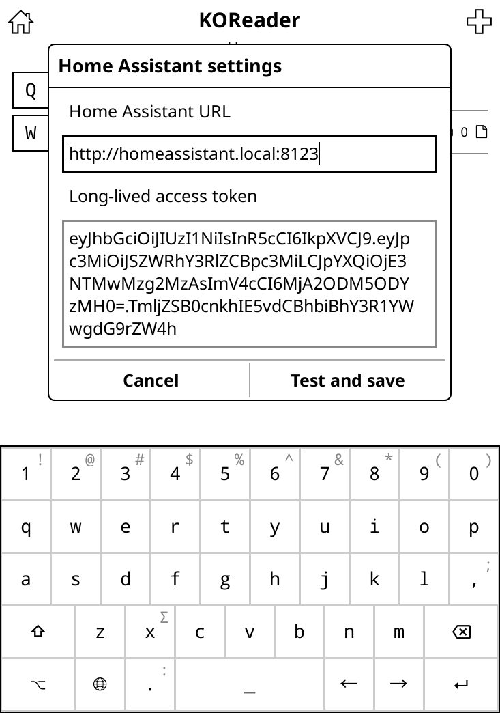

# KOReader Home Assistant dashboard
A plugin for KOReader that allows you to control devices connected to Home Assistant.

Got an E-ink eBook reader kicking around with KOReader installed? And do you want to control your smart home with it? Then this plugin will enable you to do so! You can use it while reading or perhaps use it as an always-on low energy wall-mounted display!

**Note:** Hi there! 👋 This plugin is very much work in progress and not usable yet. You're welcome to check in once a while to see progress!

## Installation
1. Download the plugin files.
2. Place the `ha_dashboard.koplugin` folder in the `koreader/plugins` directory.
3. Restart KOReader to see the plugin in action.

## Configuration
Create a long-lived-access-token in Home Assistant:
- Visit your account profile settings, under the Security tab.
- Create a Long-lived access token.
- Copy the access token.

Because the token is very long to type in, which is prone to errors, you can setup your configuration using your computer instead.

On your KOReader device, create a configuration file and add your information:
```lua
return {
    ["base_url"] = "<ENTER YOUR HOME ASSISTANT URL HERE>",
    ["entities"] = {},
    ["settings_are_valid"] = false,
    ["token"] = "<PASTE YOUR TOKEN HERE>",
}
```
Save it as ```.config/koreader/settings/ha_dashboard.lua```

If everything works out, you should see this settings screen after a welcome message:


*(Don't worry, the token in the screenshot is fake.)*

## Usage
Once installed, you can access Home Assistant from the KOReader menu. When you start the dashboard for the first time, the settings dialog will appear. Enter the URL and token and then save your settings by tapping `Test and save`. After the test succeeds, a dialog with a list of devices will show.

## Features
- Specify a list of devices you want to control from KOReader
- Specify what kind of action you want to perform per device (for example, toggle a light)
- See the current state of your devices (i.e. on/off)

## Troubleshooting

### The settings test fails
Make sure that your Home Assistant URL is correct and does not contain any tailing slashes and do not add /api at the end. The default Home Assistant URL is [http://homeassistant.local:8123](http://homeassistant.local:8123). 

### The token is not accepted
Make sure that your Home Assistant URL is correct and confirm you can open it in a web browser. The default Home Assistant URL is [http://homeassistant.local:8123](http://homeassistant.local:8123).
If you also can't access Home Assistant from your web browser, make sure you are not IP banned. This can happen when there were too many failed login attempts. See: https://www.home-assistant.io/integrations/http/#ip-filtering-and-banning